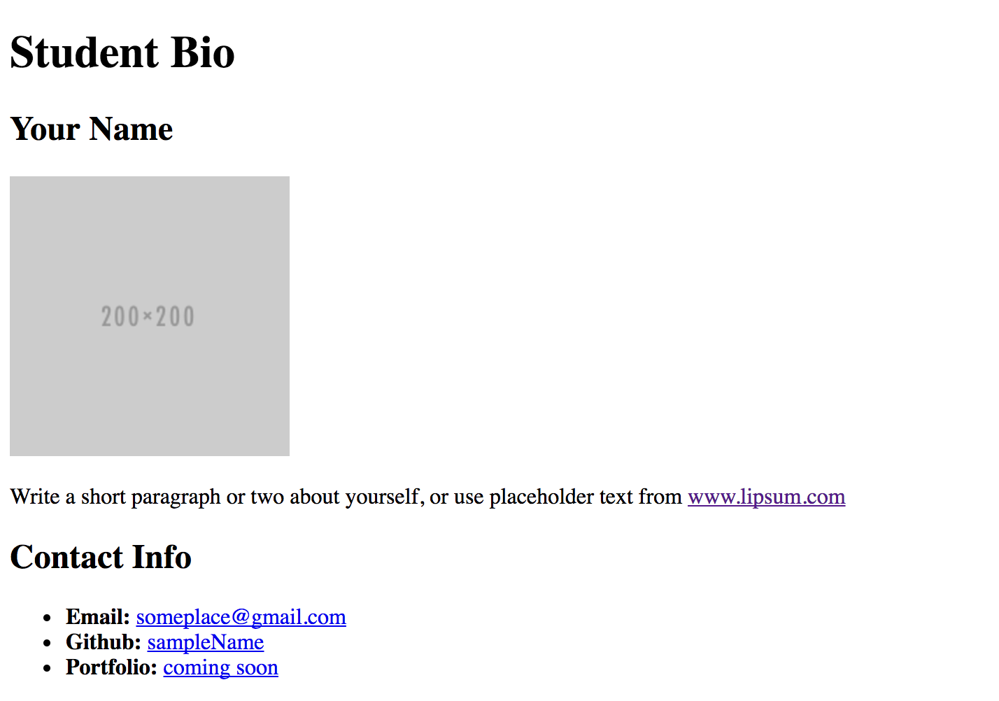

# Instructions

* Create a new repository and clone it somewhere (outside of this class repository so that it doesn't get confusing)

* (Inside that new cloned repo) Create a basic HTML page with your own information that looks similar to the design shown on screen.

  
